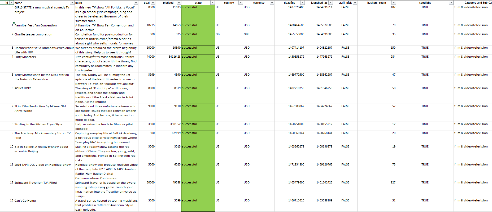
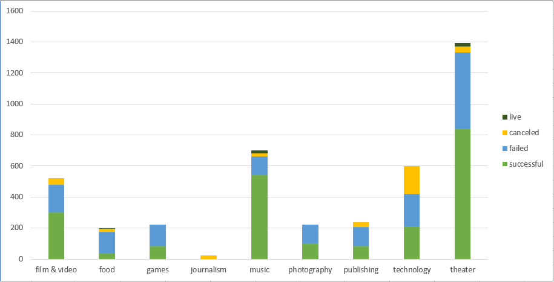
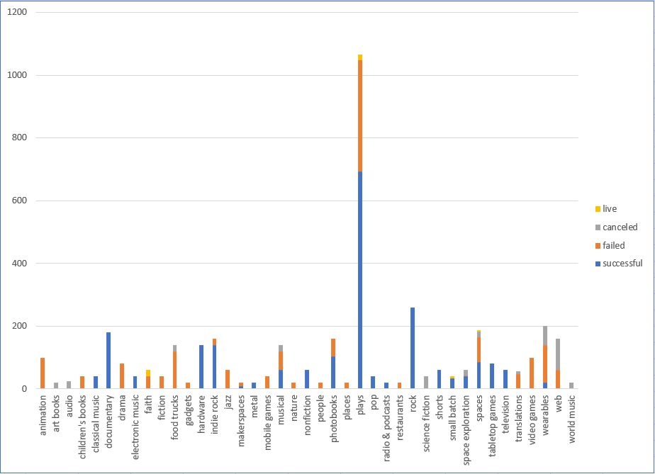
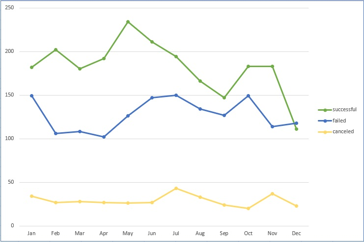

# Kickstarter Campaign Analylsis 2008 - 2017

## Author

Ashley Sligh

## Programming Language/Tools Applied

VBA, Pivot Table visualizations and charts

## Background

Over $2 billion has been raised using the massively successful crowdfunding service, Kickstarter, but not every project has found success. Of the more than 300,000 projects launched on Kickstarter, only a third have made it through the funding process with a positive outcome.

Getting funded on Kickstarter requires meeting or exceeding the project's initial goal, so many organizations spend months looking through past projects in an attempt to discover some trick for finding success. This project seeks to organize and analyze a database extract of 4,000 past projects in order to uncover market trends.

## Illustrative Data Sample

## Conclusion 1

After expanding pivot chart data to capture additional points, music has the highest Kickstarter campaign success rate at 77% followed by theater at 60% and film and video at 58% and they also have the lowest cancellation rate at 3%, 3%, and 8% respectively. The projects also have the lowest failure rates at 17%, 35% and 35% respectively.  At first glance, one may choose to make project investment decisions based on historical project success rate but the decision to do so really needs to be based on multiple factors. With this in mind, it’s important to look for other indicators of project success rate – those that point to a correlation, albeit maybe not obvious on first glance. Of interest is the “staff pick” column; does any correlation exist between staff pick and project success rate?  After performing analysis in relation to staff picks as a percentage of all staff picks across a category, a clear trend is observed. Staff picks are an excellent predictor of Kickstarter campaign success as indicated by the “% of total staff picks” column. For the theater, technology, publishing, music, games, food, and film/and video categories, simply following staff picks would have resulted in excellent results. However, it should be noted that past performance is not predictor of future results.

## Conclusion 2

After creating a pivot chart to analyze the Kickstarter campaigns across sub-category, one can quickly conclude the “plays” sub-category has the highest number of funding opportunities, capturing nearly 26% all campaign sub-categories. Of interest was the 100% rate in sub-categories such as documentary, hardware, metal, non-fiction, and rock however with overall campaign numbers much lower than the “plays” sub-category.  

## Conclusion 3

With regards to Kickstarter campaign count and the seasonality effect, a clear trend emerges.  After observing the below pivot chart, the number of successful, failed, and cancelled projects drop off significantly in the 4th quarter. The number of successful projects peak in April.  Such insight is relevant as it provides insight into the availability and timing of investments.

## Supportive Visualizations

## Dataset Limitations

* Multiple limitations exist within the data, the first being the overall quality of the data. Generally speaking, when a data analyst is ready to conduct analysis, it is highly preferred that the data be scrubbed/transformed upstream before the data analysis phase begins. For example, the necessity to transform “deadline” and “launched at” columns in UNIX format into a human-readable format, as well as splitting the category and sub-category columns are activities that should have been done ahead of time. Manipulating “end data” should be avoided because it (1) may introduce user error into the data (fat finger) that may be difficult to identify and (2) adds another layer of data manipulation that should all be handled in one central location so if changes are needed, it would be easy to pinpoint the location of source of data transformation instead of tracking down potential sources of change throughout the entire process.

* A second limitation is the wide dispersion around the categories of data. There is more data available around popular campaigns such as theatre and not as much for other campaigns such as those in journalism. This becomes important when conducting an analysis over a timespan, there isn’t enough data across all categories to make it as meaningful as it might be if there were more datapoints involved in the analysis.

* A third limitation is the relative limitation of the data going back to Kickstarter inception in 2009. There may be bias in the data, especially in the early years as data may not be as plentiful as in the later years as there was limited history associated with company, thereby making due diligence of potential crowd funders an issue. Generally speaking, the data analyst may decide to omit the first 3 years of operation, only focusing on later years, however doing so would be too aggressive because of the relatively short operating history of the company and in the case of Kickstarter, each record counts.

* A fourth limitation of the dataset is the general lack of transparency regarding data collection as the original source(s) of data. For example, have any records been omitted or are they all included, dating back to day one of Kickstarter inception? Such insight is important as the end user needs to be assured if all data is present when making decisions regarding the data.  Such an understanding is critically important as the data is likely to be used in the decision-making process to deploy financial resources.

* A fifth limitation is the lack of granularity in the data.  Plays are the most popular sub-category by a wide margin, follow-up is needed in terms of, (1) why and (2) which types of plays are the most popular and (3) what is the medium of delivery (virtual or on-location) and (4) the geographic regions of the plays.

* A sixth and major limitation of the data is the omission of data around profitability of successfully crowdfunded campaigns 1,3, and 5 years into the future.  The existence of the data would allow the users to gauge in a financial sense, which campaign types, over a period of time, offer the greatest investment payoff. This could have been captured by the addition of 1,3, and 5-year return-on-investment (ROI) columns.

* A seventh limitation, and severe one in my opinion is that only Kickstarter data is being observed. Other crowdfunding sources of data are not included and from different countries. In this case, we’re only observing the data in isolation and with no other sets of data to compare it against. With that being said, the only statistical measures are with itself rather than performing multiple regression or correlation statistics to see how the data compares across categories to other categories from other crowdfunding sources.

* An eighth and final limitation of the data is the omission of the exchange rate that was used to convert all non-us currency to US currency as was assumed in the raw dataset since the amounts in the “pledged” and “average donation” column are all in USD as indicated by the “$”.  
